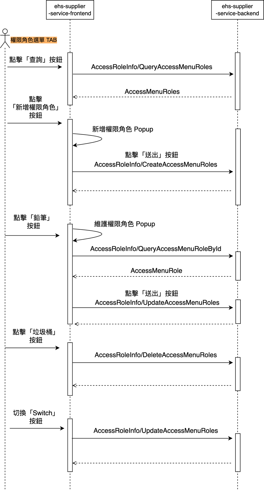
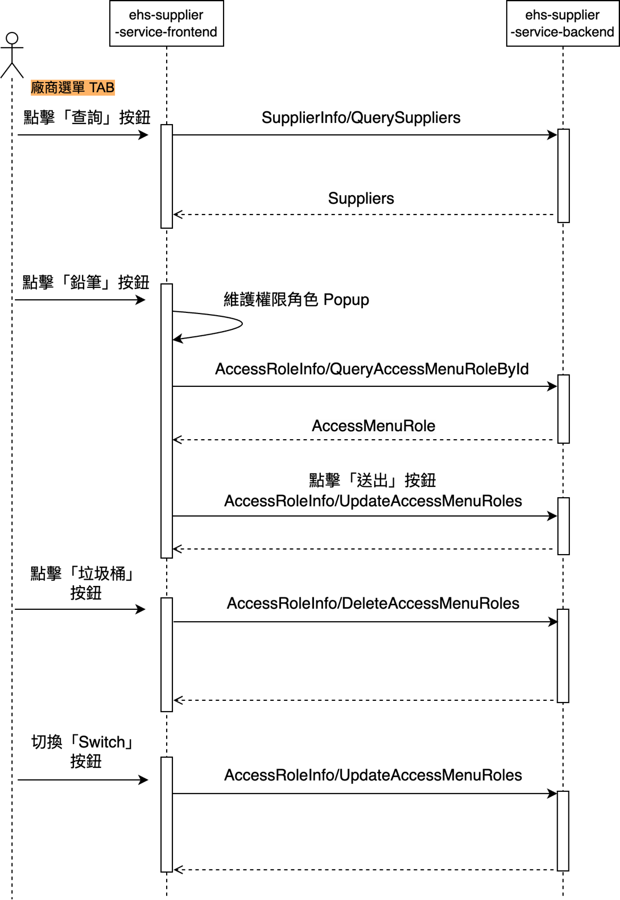
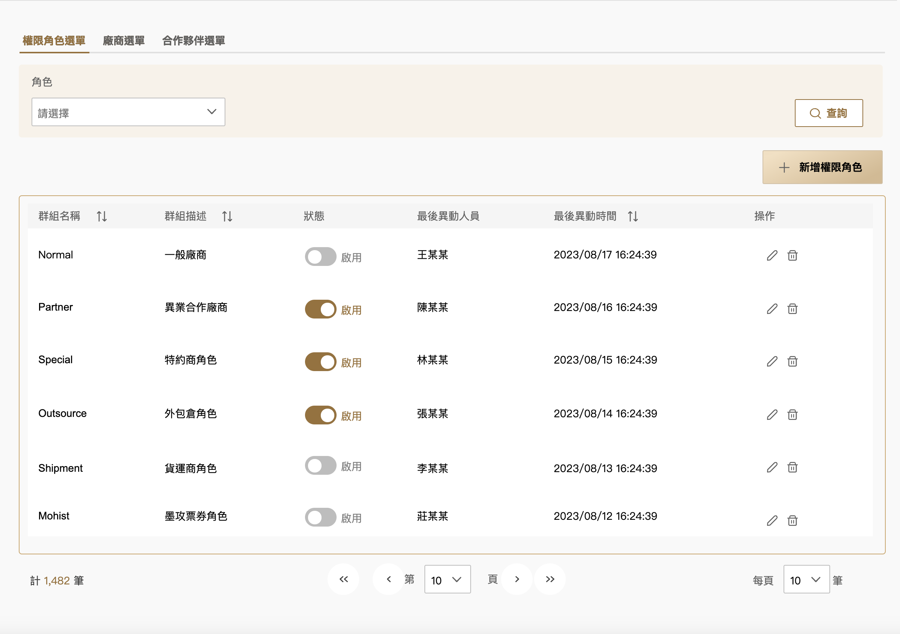
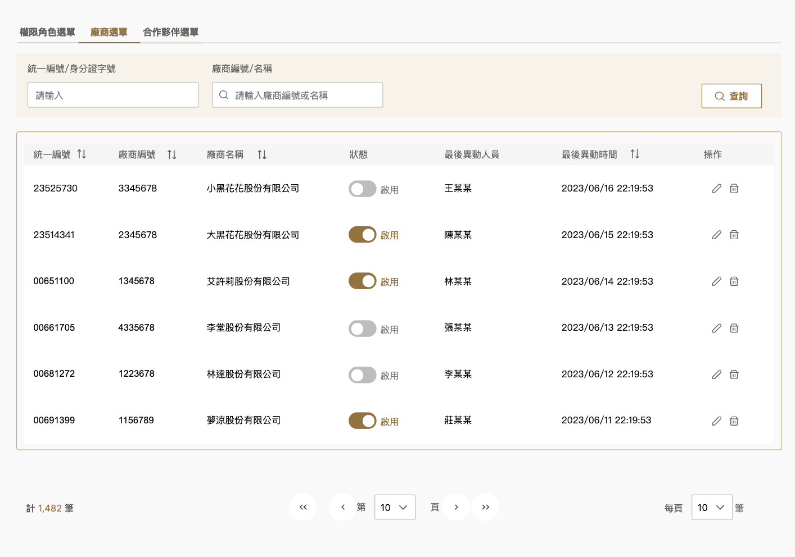
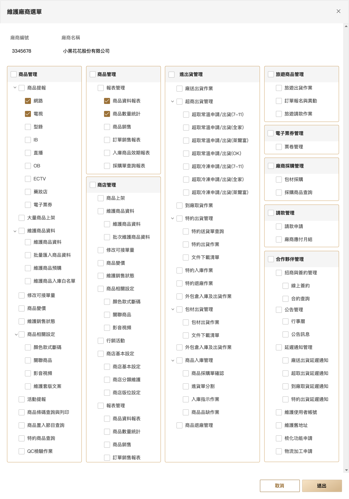

+---------------------------------------------------------------------------+
| 東森得易購股份有限公司                                                    |
|                                                                           |
| 東森購物平台建置專案                                                      |
|                                                                           |
| 系統設計報告書                                                            |
+---------------------------------------------------------------------------+
| 廠商及合作夥伴權限與選單維護                                              |
+---------------------------------------------------------------------------+
|                                                                           |
+---------------------------------------------------------------------------+
|   -------------------- -------------------------------------------------- |
|        專案代號：      東森購物平台建置專案                               |
|                                                                           |
|        文件代號：      ETM2.0-SRM-廠商及合作夥伴權限與選單維護.docx       |
|                                                                           |
|        版　　本：      0.1                                                |
|                                                                           |
|        日　　期：      2024年1月24日                                      |
|                                                                           |
|        撰　　寫：      Andy Jin                                           |
|   -------------------- -------------------------------------------------- |
+---------------------------------------------------------------------------+

# 廠商及合作夥伴權限與選單維護 {#廠商及合作夥伴權限與選單維護 .TOC-Heading}

[1. 功能說明 [6](#功能說明)](#功能說明)

[2. 業務或畫面流程及說明 [7](#業務或畫面流程及說明)](#業務或畫面流程及說明)

[2.1. 廠商及合作夥伴帳號與權限維護 [7](#廠商及合作夥伴帳號與權限維護)](#廠商及合作夥伴帳號與權限維護)

[2.1.1. 權限角色選單 TAB [7](#權限角色選單-tab)](#權限角色選單-tab)

[2.1.2. 廠商選單 TAB [8](#廠商選單-tab)](#廠商選單-tab)

[2.1.3. 合作夥伴選單 TAB [9](#合作夥伴選單-tab)](#合作夥伴選單-tab)

[3. 輸入輸出畫面及欄位說明 [10](#輸入輸出畫面及欄位說明)](#輸入輸出畫面及欄位說明)

[3.1. 權限角色選單維護(功能首頁) [10](#權限角色選單維護功能首頁)](#權限角色選單維護功能首頁)

[3.1.1. 權限角色選單 TAB [10](#權限角色選單-tab-1)](#權限角色選單-tab-1)

[**3.1.1.1.** 前端欄位 [10](#前端欄位)](#前端欄位)

[**3.1.1.2.** 動作與事件 [11](#動作與事件)](#動作與事件)

[3.1.2. 新增權限角色(Pop-up) [13](#新增權限角色pop-up)](#新增權限角色pop-up)

[**3.1.2.1.** 前端欄位 [13](#前端欄位-1)](#前端欄位-1)

[**3.1.2.2.** 動作與事件 [14](#動作與事件-1)](#動作與事件-1)

[3.1.3. 維護權限角色(Pop-up) [15](#維護權限角色pop-up)](#維護權限角色pop-up)

[**3.1.3.1.** 前端欄位 [15](#前端欄位-2)](#前端欄位-2)

[**3.1.3.2.** 動作與事件 [16](#動作與事件-2)](#動作與事件-2)

[3.1.4. 廠商選單 TAB [18](#廠商選單-tab-1)](#廠商選單-tab-1)

[**3.1.4.1.** 前端欄位 [18](#前端欄位-3)](#前端欄位-3)

[**3.1.4.2.** 動作與事件 [19](#動作與事件-3)](#動作與事件-3)

[3.1.5. 維護廠商選單(Pop-up) [20](#維護廠商選單pop-up)](#維護廠商選單pop-up)

[**3.1.5.1.** 前端欄位 [20](#前端欄位-4)](#前端欄位-4)

[**3.1.5.2.** 動作與事件 [22](#動作與事件-4)](#動作與事件-4)

[3.1.6. 合作夥伴選單 TAB [23](#合作夥伴選單-tab-1)](#合作夥伴選單-tab-1)

[**3.1.6.1.** 前端欄位 [23](#前端欄位-5)](#前端欄位-5)

[**3.1.6.2.** 動作與事件 [24](#動作與事件-5)](#動作與事件-5)

[3.1.7. 維護合作夥伴選單(Pop-up) [25](#維護合作夥伴選單pop-up)](#維護合作夥伴選單pop-up)

[**3.1.7.1.** 前端欄位 [25](#前端欄位-6)](#前端欄位-6)

[**3.1.7.2.** 前端欄位 [26](#前端欄位-7)](#前端欄位-7)

[4. API說明 [27](#api說明)](#api說明)

[4.1. 查詢角色清單 [27](#查詢角色清單-1)](#查詢角色清單-1)

[4.2. 更新角色權限資料 [27](#更新角色權限資料)](#更新角色權限資料)

[4.3. 新增角色權限資料 [28](#新增角色權限資料)](#新增角色權限資料)

[4.4. 刪除角色權限資料 [29](#刪除角色權限資料)](#刪除角色權限資料)

[4.5. 查詢B2B功能清單 [29](#查詢b2b功能清單)](#查詢b2b功能清單)

[查詢B2B功能清單 [29](#查詢b2b功能清單-1)](#查詢b2b功能清單-1)

[5. 錯誤訊息代碼 [31](#錯誤訊息代碼)](#錯誤訊息代碼)

[6. 角色權限代碼 [32](#角色權限代碼)](#角色權限代碼)

[7. Database Design [33](#database-design)](#database-design)

[7.1. Database Tables Diagram [33](#database-tables-diagram)](#database-tables-diagram)

[7.2. Database Tables Schema [33](#database-tables-schema)](#database-tables-schema)

[7.2.1. Table \[SRM_COLLABORATION\]關聯共用主檔 [33](#table-srm_collaboration關聯共用主檔)](#table-srm_collaboration關聯共用主檔)

[7.2.2. Table \[SRM_SUPPLIER\]供應商主檔 [34](#table-srm_supplier供應商主檔)](#table-srm_supplier供應商主檔)

[7.2.3. Table \[SRM_PARTNER\]合作夥伴 [35](#table-srm_partner合作夥伴)](#table-srm_partner合作夥伴)

[7.2.4. Table \[SRM_ACCESSROLESETTING\]ACCESSROLESETTING [36](#table-srm_accessrolesettingaccessrolesetting)](#table-srm_accessrolesettingaccessrolesetting)

[7.2.5. Table \[SRM_SYSTEMFUNCTION\]B2B功能表 [36](#table-srm_systemfunctionb2b功能表)](#table-srm_systemfunctionb2b功能表)

[7.2.6. Table \[SRM_FUNCTIONMAPPING\]B2B功能Mapping檔 [37](#table-srm_functionmappingb2b功能mapping檔)](#table-srm_functionmappingb2b功能mapping檔)

[8. 外部依賴 [38](#外部依賴)](#外部依賴)

[9. 批次執行 [39](#批次執行)](#批次執行)

  --------------------------------------------------------------------------------
   **變更記錄**                          
  -------------- ------------ ---------- -----------------------------------------
     **日期**      **作者**    **版本**                  **摘要**

    2024/1/24      Andy Jin      0.1                       初版

                                         
  --------------------------------------------------------------------------------

  -----------------------------------------------------------------------
  **追蹤事項**
  -----------------------------------------------------------------------

  -----------------------------------------------------------------------

# 功能說明

  -----------------------------------------------------------------------------------------------------------------------------------------------
  **功能名稱**       廠商及合作夥伴權限與選單維護
  ------------------ ----------------------------------------------------------------------------------------------------------------------------
  **功能代號**       SRM-TX-0311

  **功能簡述**       提供研發人員依照角色(包含一般廠商、特約商角色、外包倉角色等)設定B2B 選單權限，亦可依照特定廠商及合作夥伴設定B2B 選單權限。

  **進入功能路徑**   供應商暨合作夥伴平台\>廠商及合作夥伴帳號與權限維護\>廠商及合作夥伴權限與選單維護

  **使用權限控管**   ■是 □否

  **使用審核流程**   □是 ■否

  **其他說明**       
  -----------------------------------------------------------------------------------------------------------------------------------------------

# 業務或畫面流程及說明

## 廠商及合作夥伴帳號與權限維護

### 權限角色選單 TAB

{width="4.576550743657043in" height="8.483333333333333in"}

### 廠商選單 TAB

{width="4.93551290463692in" height="7.164835958005249in"}

### 合作夥伴選單 TAB

{width="4.327661854768154in" height="8.021978346456693in"}

# 輸入輸出畫面及欄位說明

## 權限角色選單維護(功能首頁)

### 權限角色選單 TAB

#### 前端欄位

  -------------------------------------------------------------------------------------------
                                        權限角色選單TAB
  -------------------------------------------------------------------------------------------
   {width="6.45369750656168in" height="4.54659230096238in"}

  -------------------------------------------------------------------------------------------

-   欄位說明

+------------------------------------------------------------------------------------------------------------+----------------------------------------+------------------+--------------+--------------+--------------------------------------------------------------------------+
| **\#**                                                                                                     | **中文欄位**                           | **英文欄位**     | **資料型態** | **欄位型態** | **說明**                                                                 |
+============================================================================================================+========================================+==================+==============+==============+==========================================================================+
| 1.                                                                                                         | 權限角色選單/廠商選單/合作夥伴選單 TAB |                  | 文字         | 文字         | (1) 依序顯示：權限角色選單、廠商選單、合作夥伴選單。                     |
|                                                                                                            |                                        |                  |              |              |                                                                          |
|                                                                                                            |                                        |                  |              |              | (2) 預設在權限角色選單 TAB。                                             |
+------------------------------------------------------------------------------------------------------------+----------------------------------------+------------------+--------------+--------------+--------------------------------------------------------------------------+
| 以下為**查詢條件**區塊                                                                                     |                                        |                  |              |              |                                                                          |
+------------------------------------------------------------------------------------------------------------+----------------------------------------+------------------+--------------+--------------+--------------------------------------------------------------------------+
| 2.                                                                                                         | 角色                                   | roles            | string       | 一般下拉選單 | (1) 提示文字：請選擇。                                                   |
|                                                                                                            |                                        |                  |              |              |                                                                          |
|                                                                                                            |                                        |                  |              |              | (2) 請參考動作與事件[(角色)](#角色init)。                                |
+------------------------------------------------------------------------------------------------------------+----------------------------------------+------------------+--------------+--------------+--------------------------------------------------------------------------+
| 3.                                                                                                         | 查詢                                   |                  |              | 按鈕         | (1) 請參考動作與事件[(查詢)](#查詢角色清單)。                            |
+------------------------------------------------------------------------------------------------------------+----------------------------------------+------------------+--------------+--------------+--------------------------------------------------------------------------+
| 以上為**查詢條件**區塊                                                                                     |                                        |                  |              |              |                                                                          |
+------------------------------------------------------------------------------------------------------------+----------------------------------------+------------------+--------------+--------------+--------------------------------------------------------------------------+
| 以下為**功能按鈕**區塊                                                                                     |                                        |                  |              |              |                                                                          |
+------------------------------------------------------------------------------------------------------------+----------------------------------------+------------------+--------------+--------------+--------------------------------------------------------------------------+
| 4.                                                                                                         | 新增權限角色                           |                  |              | 按鈕         | (1) 請參考動作與事件[「新增權限角色Pop-up」](#新增權限角色click)。       |
+------------------------------------------------------------------------------------------------------------+----------------------------------------+------------------+--------------+--------------+--------------------------------------------------------------------------+
| 以上為**功能按鈕**區塊                                                                                     |                                        |                  |              |              |                                                                          |
+------------------------------------------------------------------------------------------------------------+----------------------------------------+------------------+--------------+--------------+--------------------------------------------------------------------------+
| 以下為**查詢結果**區塊                                                                                     |                                        |                  |              |              |                                                                          |
|                                                                                                            |                                        |                  |              |              |                                                                          |
| (1) 系統預設排序欄位：\[modifiedDate\](desc)，若是使用者選擇以其他欄位排序，將影響原系統預設排序結果。     |                                        |                  |              |              |                                                                          |
|                                                                                                            |                                        |                  |              |              |                                                                          |
| (2) 以**sortable**表示使用者可以決定該欄位遞增、遞減排序，未提及欄位表示系統不提供自行決定該欄位排序方式。 |                                        |                  |              |              |                                                                          |
|                                                                                                            |                                        |                  |              |              |                                                                          |
| (3) 以**enable**表示該欄位可編輯，未提及欄位表示不可編輯欄位內容。                                         |                                        |                  |              |              |                                                                          |
+------------------------------------------------------------------------------------------------------------+----------------------------------------+------------------+--------------+--------------+--------------------------------------------------------------------------+
| 5.                                                                                                         | 群組名稱                               | groupName        | string       | 文字         | (1) 顯示：{ groupName }。                                                |
|                                                                                                            |                                        |                  |              |              |                                                                          |
|                                                                                                            |                                        |                  |              |              | (2) **sortable**。                                                       |
+------------------------------------------------------------------------------------------------------------+----------------------------------------+------------------+--------------+--------------+--------------------------------------------------------------------------+
| 6.                                                                                                         | 群組描述                               | groupDescription | string       | 文字         | (1) 顯示：{ groupDescription }。                                         |
|                                                                                                            |                                        |                  |              |              |                                                                          |
|                                                                                                            |                                        |                  |              |              | (2) **sortable**。                                                       |
+------------------------------------------------------------------------------------------------------------+----------------------------------------+------------------+--------------+--------------+--------------------------------------------------------------------------+
| 7.                                                                                                         | 狀態                                   | status           | string       | SwitchBtn    | (1) 顯示：{ status }。                                                   |
|                                                                                                            |                                        |                  |              |              |                                                                          |
|                                                                                                            |                                        |                  |              |              | (2) **enable**。                                                         |
|                                                                                                            |                                        |                  |              |              |                                                                          |
|                                                                                                            |                                        |                  |              |              | (3) 請參考動作與事件([狀態](#狀態切換))。                                |
+------------------------------------------------------------------------------------------------------------+----------------------------------------+------------------+--------------+--------------+--------------------------------------------------------------------------+
| 8.                                                                                                         | 最後異動人員                           | modifiedBy       | string       | 文字         | (1) 顯示：{ modifiedBy }。                                               |
+------------------------------------------------------------------------------------------------------------+----------------------------------------+------------------+--------------+--------------+--------------------------------------------------------------------------+
| 9.                                                                                                         | 最後異動時間                           | modifiedDate     | date         | 文字         | (2) 顯示：{ modifiedDate }。                                             |
|                                                                                                            |                                        |                  |              |              |                                                                          |
|                                                                                                            |                                        |                  |              |              | (3) 格式：yyyy/MM/dd HH:mm:ss。                                          |
|                                                                                                            |                                        |                  |              |              |                                                                          |
|                                                                                                            |                                        |                  |              |              | (4) **sortable**。                                                       |
+------------------------------------------------------------------------------------------------------------+----------------------------------------+------------------+--------------+--------------+--------------------------------------------------------------------------+
| 10.                                                                                                        | 操作                                   |                  | icon         | 按鈕         | (1) 依序顯示：編輯icon、刪除icon。                                       |
|                                                                                                            |                                        |                  |              |              |                                                                          |
|                                                                                                            |                                        |                  |              |              | (2) 顯示編輯icon，請參考動作與事件([維護權限角色](#維護權限角色click))。 |
|                                                                                                            |                                        |                  |              |              |                                                                          |
|                                                                                                            |                                        |                  |              |              | (3) 顯示刪除icon，點選後請參考動作與事件([刪除](#刪除click))。           |
+------------------------------------------------------------------------------------------------------------+----------------------------------------+------------------+--------------+--------------+--------------------------------------------------------------------------+
| 以上為**查詢結果**區塊                                                                                     |                                        |                  |              |              |                                                                          |
+------------------------------------------------------------------------------------------------------------+----------------------------------------+------------------+--------------+--------------+--------------------------------------------------------------------------+

#### 動作與事件

+--------------------------------------------+--------+--------+-----------------------------------------------------------------------+----------+
| 元件                                       | 動作   | 檢核   | 說明                                                                  | 錯誤處理 |
+============================================+========+========+=======================================================================+==========+
| []{#查詢角色清單 .anchor}查詢              | click  |        | (1) 查詢條件：                                                        |          |
|                                            |        |        |                                                                       |          |
|                                            |        |        |     A.  若為權限角色選單TAB，依\[權限角色\]查詢。                     |          |
|                                            |        |        |                                                                       |          |
|                                            |        |        |     B.  若為廠商選單TAB，依\[統一編號/身分證字號\]+\[廠商名稱\]查詢。 |          |
|                                            |        |        |                                                                       |          |
|                                            |        |        |     C.  若為合作夥伴選單TAB，依\[合作夥伴姓名\]+\[合作角色\]查詢。    |          |
+--------------------------------------------+--------+--------+-----------------------------------------------------------------------+----------+
| []{#新增權限角色click .anchor}新增權限角色 | click  |        | (1) 點選後開啟[「新增權限角色Pop-up」](#新增權限角色)。               |          |
+--------------------------------------------+--------+--------+-----------------------------------------------------------------------+----------+
| []{#維護權限角色click .anchor}維護權限角色 | click  |        | (1) 點選後開啟[「維護權限角色Pop-up」](#維護權限角色pop-up)。         |          |
+--------------------------------------------+--------+--------+-----------------------------------------------------------------------+----------+
| []{#角色init .anchor}角色                  | init   |        | (1) 呼叫「[查詢角色清單](#查詢角色清單-1)」取得下拉選單資料。         |          |
+--------------------------------------------+--------+--------+-----------------------------------------------------------------------+----------+
| []{#狀態切換 .anchor}狀態                  | change |        | (1) 呼叫「[更新角色權限清單](#更新角色權限資料)」更新資料。           |          |
+--------------------------------------------+--------+--------+-----------------------------------------------------------------------+----------+
| []{#刪除click .anchor}刪除                 | click  |        | (1) 呼叫「[刪除角色權限資料](#刪除角色權限資料)」變更資料。           |          |
+--------------------------------------------+--------+--------+-----------------------------------------------------------------------+----------+

**\
**

### 新增權限角色(Pop-up)

#### 前端欄位

  ------------------------------------------------------------------------------------------------------------------------------------------------------------
                                                                     新增權限角色 (Pop-up)
  ------------------------------------------------------------------------------------------------------------------------------------------------------------
   {width="5.590646325459318in" height="8.016666666666667in"}

  ------------------------------------------------------------------------------------------------------------------------------------------------------------

-   欄位說明

+-------------------------------------------------------------------------------------------+--------------+------------------+----------+--------------+------------------------------------------------+
| **\#**                                                                                    | **中文欄位** | **英文欄位**     | **資料** | **欄位型態** | **說明**                                       |
|                                                                                           |              |                  |          |              |                                                |
|                                                                                           |              |                  | **型態** |              |                                                |
+===========================================================================================+==============+==================+==========+==============+================================================+
| 1.                                                                                        | 標題         |                  | string   | 文字         | (1) 顯示文案：新增權限角色。                   |
+-------------------------------------------------------------------------------------------+--------------+------------------+----------+--------------+------------------------------------------------+
| 以下為**權限角色選單資訊**區塊                                                            |              |                  |          |              |                                                |
|                                                                                           |              |                  |          |              |                                                |
| (1) 以**required**表示該欄位必須有值，未提及欄位表示由使用者自行決定是否選取/輸入欄位值。 |              |                  |          |              |                                                |
+-------------------------------------------------------------------------------------------+--------------+------------------+----------+--------------+------------------------------------------------+
| 2.                                                                                        | 群組名稱     | groupName        | string   | 一般輸入框   | (1) 提示文字：請輸入。                         |
|                                                                                           |              |                  |          |              |                                                |
|                                                                                           |              |                  |          |              | (2) **required**。                             |
|                                                                                           |              |                  |          |              |                                                |
|                                                                                           |              |                  |          |              | (3) 限輸入最多15個中英文字。                   |
+-------------------------------------------------------------------------------------------+--------------+------------------+----------+--------------+------------------------------------------------+
| 3.                                                                                        | 群組描述     | groupDescription | string   | 一般輸入框   | (1) 提示文字：請輸入。                         |
|                                                                                           |              |                  |          |              |                                                |
|                                                                                           |              |                  |          |              | (2) **required**。                             |
|                                                                                           |              |                  |          |              |                                                |
|                                                                                           |              |                  |          |              | (3) 限輸入最多15個中英文字。                   |
+-------------------------------------------------------------------------------------------+--------------+------------------+----------+--------------+------------------------------------------------+
| 4.                                                                                        | B2B功能選單  | 文字             | Checkbox | 輸入         | (1) 必填。                                     |
|                                                                                           |              |                  |          |              |                                                |
|                                                                                           |              |                  |          |              | (2) 選項請參考 B2B功能清單。                   |
+-------------------------------------------------------------------------------------------+--------------+------------------+----------+--------------+------------------------------------------------+
| 以上為**權限角色選單資訊**區塊                                                            |              |                  |          |              |                                                |
+-------------------------------------------------------------------------------------------+--------------+------------------+----------+--------------+------------------------------------------------+
| 以下為**功能按鈕**區塊                                                                    |              |                  |          |              |                                                |
+-------------------------------------------------------------------------------------------+--------------+------------------+----------+--------------+------------------------------------------------+
| 5.                                                                                        | 送出         |                  |          | 按鈕         | (1) 請參考動作與事件[(送出)](#送出按鈕click)。 |
+-------------------------------------------------------------------------------------------+--------------+------------------+----------+--------------+------------------------------------------------+
| 6.                                                                                        | 取消         |                  |          | 按鈕         | (1) 點選取消，關閉視窗回到原頁。               |
+-------------------------------------------------------------------------------------------+--------------+------------------+----------+--------------+------------------------------------------------+
| 以上為功能**按鈕**區塊                                                                    |              |                  |          |              |                                                |
+-------------------------------------------------------------------------------------------+--------------+------------------+----------+--------------+------------------------------------------------+

#### 動作與事件

+--------------------------------+-------+--------+-----------------------------------------------------------------------------------+-----------------+
| 元件                           | 動作  | 檢核   | 說明                                                                              | 錯誤處理        |
+================================+=======+========+===================================================================================+=================+
| []{#送出按鈕click .anchor}送出 | click |        | (1) 呼叫「[新增角色權限資料](#新增角色權限資料)」新增一筆資料對應。               |                 |
|                                |       |        |                                                                                   |                 |
|                                |       |        | (2) 送出新增至供應商平台                                                          |                 |
|                                |       |        |                                                                                   |                 |
|                                |       |        |     A.  若送出成功，則顯示成功 toast 訊息：已送出申請\<換行\>已成功送出選單新增。 |                 |
+--------------------------------+-------+--------+-----------------------------------------------------------------------------------+-----------------+
| 取消                           | click |        | (1) 關閉視窗回到原頁。                                                            |                 |
+--------------------------------+-------+--------+-----------------------------------------------------------------------------------+-----------------+

### 維護權限角色(Pop-up)

#### 前端欄位

  ---------------------------------------------------------------------------------------------
                                      維護權限角色 (Pop-up)
  ---------------------------------------------------------------------------------------------
   {width="5.443312554680665in" height="7.827918853893263in"}

  ---------------------------------------------------------------------------------------------

-   欄位說明

+-------------------------------------------------------------------------------------------+--------------+------------------+----------+--------------+----------------------------------------------------------+
| **\#**                                                                                    | **中文欄位** | **英文欄位**     | **資料** | **欄位型態** | **說明**                                                 |
|                                                                                           |              |                  |          |              |                                                          |
|                                                                                           |              |                  | **型態** |              |                                                          |
+===========================================================================================+==============+==================+==========+==============+==========================================================+
| 1.                                                                                        | 標題         |                  | 文字     | 文字         | (1) 顯示文案：維護角色選單。                             |
+-------------------------------------------------------------------------------------------+--------------+------------------+----------+--------------+----------------------------------------------------------+
| 以下為**權限角色選單資訊**區塊                                                            |              |                  |          |              |                                                          |
|                                                                                           |              |                  |          |              |                                                          |
| (1) 以**required**表示該欄位必須有值，未提及欄位表示由使用者自行決定是否選取/輸入欄位值。 |              |                  |          |              |                                                          |
|                                                                                           |              |                  |          |              |                                                          |
| (2) 以**enable**表示該欄位可編輯，未提及欄位表示不可編輯欄位內容。                        |              |                  |          |              |                                                          |
+-------------------------------------------------------------------------------------------+--------------+------------------+----------+--------------+----------------------------------------------------------+
| 2.                                                                                        | 群組名稱     | groupName        | string   | 一般輸入框   | (1) **required**。                                       |
|                                                                                           |              |                  |          |              |                                                          |
|                                                                                           |              |                  |          |              | (2) **enable**。                                         |
|                                                                                           |              |                  |          |              |                                                          |
|                                                                                           |              |                  |          |              | <!-- -->                                                 |
|                                                                                           |              |                  |          |              |                                                          |
|                                                                                           |              |                  |          |              | (3) 限輸入最多15個中英文字。                             |
+-------------------------------------------------------------------------------------------+--------------+------------------+----------+--------------+----------------------------------------------------------+
| 3.                                                                                        | 群組描述     | groupDescription | string   | 一般輸入框   | (1) **required**。                                       |
|                                                                                           |              |                  |          |              |                                                          |
|                                                                                           |              |                  |          |              | (2) **enable**。                                         |
|                                                                                           |              |                  |          |              |                                                          |
|                                                                                           |              |                  |          |              | (3) 限輸入最多15個中英文字。                             |
+-------------------------------------------------------------------------------------------+--------------+------------------+----------+--------------+----------------------------------------------------------+
| 4.                                                                                        | B2B功能選單  |                  | string   | Checkbox     | (1) **required**。                                       |
|                                                                                           |              |                  |          |              |                                                          |
|                                                                                           |              |                  |          |              | (2) **enable**。                                         |
|                                                                                           |              |                  |          |              |                                                          |
|                                                                                           |              |                  |          |              | (3) 請參考動作與事件([B2B功能選單](#B2B功能選單click))。 |
+-------------------------------------------------------------------------------------------+--------------+------------------+----------+--------------+----------------------------------------------------------+
| 以上為**權限角色選單資訊**區塊                                                            |              |                  |          |              |                                                          |
+-------------------------------------------------------------------------------------------+--------------+------------------+----------+--------------+----------------------------------------------------------+
| 以下為**功能按鈕**區塊                                                                    |              |                  |          |              |                                                          |
+-------------------------------------------------------------------------------------------+--------------+------------------+----------+--------------+----------------------------------------------------------+
| 5.                                                                                        | 送出         |                  |          | 按鈕         | (1) 請參考動作與事件[(送出)](#取消click2) 。             |
+-------------------------------------------------------------------------------------------+--------------+------------------+----------+--------------+----------------------------------------------------------+
| 6.                                                                                        | 取消         |                  |          | 按鈕         | (1) 點選取消，請參考動作與事件([取消](#取消click2))。    |
+-------------------------------------------------------------------------------------------+--------------+------------------+----------+--------------+----------------------------------------------------------+
| 以上為**功能按鈕**區塊                                                                    |              |                  |          |              |                                                          |
+-------------------------------------------------------------------------------------------+--------------+------------------+----------+--------------+----------------------------------------------------------+

#### 動作與事件

+------------------------------------------+-------+--------+---------------------------------------------------------------------------------+-----------------+
| 元件                                     | 動作  | 檢核   | 說明                                                                            | 錯誤處理        |
+==========================================+=======+========+=================================================================================+=================+
| 送出                                     | click |        | (1) 呼叫「[更新角色權限資料](#更新角色權限資料)」更新資料對應。                 |                 |
|                                          |       |        |                                                                                 |                 |
|                                          |       |        | (2) 將資料存入DB                                                                |                 |
|                                          |       |        |                                                                                 |                 |
|                                          |       |        |     A.  若送出成功，則顯示成功toast訊息：已送出申請\<換行\>已成功送出選單新增。 |                 |
+------------------------------------------+-------+--------+---------------------------------------------------------------------------------+-----------------+
| []{#取消click2 .anchor}取消              | click |        | (1) 關閉視窗回到原頁。                                                          |                 |
+------------------------------------------+-------+--------+---------------------------------------------------------------------------------+-----------------+
| []{#B2B功能選單click .anchor}B2B功能選單 | init  |        | (1) 呼叫「[查詢B2B功能選單](#查詢b2b功能清單)」更新資料對應。                   |                 |
+------------------------------------------+-------+--------+---------------------------------------------------------------------------------+-----------------+

### 廠商選單 TAB

#### 前端欄位

  --------------------------------------------------------------------------------------------
  廠商選單TAB
  --------------------------------------------------------------------------------------------
  {width="6.470709755030621in" height="4.53932195975503in"}

  --------------------------------------------------------------------------------------------

-   欄位說明

+------------------------------------------------------------------------------------------------------------+---------------------+------------------+----------+--------------+---------------------------------------------------------------------------+
| **\#**                                                                                                     | **中文欄位**        | **英文欄位**     | **資料** | **欄位型態** | **說明**                                                                  |
|                                                                                                            |                     |                  |          |              |                                                                           |
|                                                                                                            |                     |                  | **型態** |              |                                                                           |
+============================================================================================================+=====================+==================+==========+==============+===========================================================================+
| 以下為**查詢條件**區塊                                                                                     |                     |                  |          |              |                                                                           |
+------------------------------------------------------------------------------------------------------------+---------------------+------------------+----------+--------------+---------------------------------------------------------------------------+
| 1.                                                                                                         | 統一編號/身分證字號 | unifyNoOrIdNo    | string   |              | (1) 提示文字：請輸入。                                                    |
|                                                                                                            |                     |                  |          |              |                                                                           |
|                                                                                                            |                     |                  |          |              | (2) 選項：顯示所有{ unifyNoOrIdNo }。                                     |
|                                                                                                            |                     |                  |          |              |                                                                           |
|                                                                                                            |                     |                  |          |              | (3) 使用共用廠商編號查詢元件。                                            |
+------------------------------------------------------------------------------------------------------------+---------------------+------------------+----------+--------------+---------------------------------------------------------------------------+
| 2.                                                                                                         | 廠商編號/名稱       | supplierIdOrName | string   |              | (1) 提示文字：請輸入廠商編號或廠商名稱。                                  |
|                                                                                                            |                     |                  |          |              |                                                                           |
|                                                                                                            |                     |                  |          |              | (2) 使用共用廠商編號查詢元件。                                            |
|                                                                                                            |                     |                  |          |              |                                                                           |
|                                                                                                            |                     |                  |          |              | (3) 使用者選取後帶回並關閉選單。                                          |
+------------------------------------------------------------------------------------------------------------+---------------------+------------------+----------+--------------+---------------------------------------------------------------------------+
| 3.                                                                                                         | 查詢                |                  |          | 按鈕         | (1) 請參考功能說明[(查詢)](#查詢)。                                       |
+------------------------------------------------------------------------------------------------------------+---------------------+------------------+----------+--------------+---------------------------------------------------------------------------+
| 以上為**查詢條件**區塊                                                                                     |                     |                  |          |              |                                                                           |
+------------------------------------------------------------------------------------------------------------+---------------------+------------------+----------+--------------+---------------------------------------------------------------------------+
| 以下為**查詢結果**區塊                                                                                     |                     |                  |          |              |                                                                           |
|                                                                                                            |                     |                  |          |              |                                                                           |
| (1) 系統預設排序欄位：\[modifiedDate\] (desc)，若是使用者選擇以其他欄位排序，將影響原系統預設排序結果。    |                     |                  |          |              |                                                                           |
|                                                                                                            |                     |                  |          |              |                                                                           |
| (2) 以**sortable**表示使用者可以決定該欄位遞增、遞減排序，未提及欄位表示系統不提供自行決定該欄位排序方式。 |                     |                  |          |              |                                                                           |
|                                                                                                            |                     |                  |          |              |                                                                           |
| (3) 以**enable**表示該欄位可編輯，未提及欄位表示不可編輯欄位內容。                                         |                     |                  |          |              |                                                                           |
+------------------------------------------------------------------------------------------------------------+---------------------+------------------+----------+--------------+---------------------------------------------------------------------------+
| 4.                                                                                                         | 統一編號/身分證字號 | unifyNoOrIdNo    | string   |              | (1) 提示文字：請輸入。                                                    |
|                                                                                                            |                     |                  |          |              |                                                                           |
|                                                                                                            |                     |                  |          |              | (2) 選項：顯示所有{ unifyNoOrIdNo }。                                     |
|                                                                                                            |                     |                  |          |              |                                                                           |
|                                                                                                            |                     |                  |          |              | (3) 使用共用廠商編號查詢元件。                                            |
+------------------------------------------------------------------------------------------------------------+---------------------+------------------+----------+--------------+---------------------------------------------------------------------------+
| 5.                                                                                                         | 廠商編號            | supplierId       | string   |              | (1) 提示文字：請輸入廠商編號或廠商名稱。                                  |
|                                                                                                            |                     |                  |          |              |                                                                           |
|                                                                                                            |                     |                  |          |              | (2) 使用共用廠商編號查詢元件。                                            |
|                                                                                                            |                     |                  |          |              |                                                                           |
|                                                                                                            |                     |                  |          |              | (3) 使用者選取後帶回並關閉選單。                                          |
+------------------------------------------------------------------------------------------------------------+---------------------+------------------+----------+--------------+---------------------------------------------------------------------------+
| 6.                                                                                                         | 廠商名稱            | supplierName     | string   | 文字         | (1) [顯示：{]{.mark} supplierName [}。]{.mark}                            |
+------------------------------------------------------------------------------------------------------------+---------------------+------------------+----------+--------------+---------------------------------------------------------------------------+
| 7.                                                                                                         | 狀態                | stauts           | string   | SwitchBtn    | (1) 顯示：{ stauts }。                                                    |
|                                                                                                            |                     |                  |          |              |                                                                           |
|                                                                                                            |                     |                  |          |              | (2) **enable**。                                                          |
|                                                                                                            |                     |                  |          |              |                                                                           |
|                                                                                                            |                     |                  |          |              | (3) 點選後啟用該廠商權限選單，並更新資料庫進行資料變動。                  |
+------------------------------------------------------------------------------------------------------------+---------------------+------------------+----------+--------------+---------------------------------------------------------------------------+
| 8.                                                                                                         | 最後異動人員        | modifiedBy       | string   | 文字         | (1) 顯示：{ modifiedBy }。                                                |
+------------------------------------------------------------------------------------------------------------+---------------------+------------------+----------+--------------+---------------------------------------------------------------------------+
| 9.                                                                                                         | 最後異動時間        | modifiedDate     | date     | 文字         | (1) 顯示：{ modifiedDate }。                                              |
|                                                                                                            |                     |                  |          |              |                                                                           |
|                                                                                                            |                     |                  |          |              | (2) 格式：YYYY/MM/DD HH:mm:ss。                                           |
|                                                                                                            |                     |                  |          |              |                                                                           |
|                                                                                                            |                     |                  |          |              | (3) **sortable**。                                                        |
+------------------------------------------------------------------------------------------------------------+---------------------+------------------+----------+--------------+---------------------------------------------------------------------------+
| 10.                                                                                                        | 操作                |                  | icon     | 按鈕         | (1) 依序顯示：編輯icon、刪除icon。                                        |
|                                                                                                            |                     |                  |          |              |                                                                           |
|                                                                                                            |                     |                  |          |              | (2) 顯示編輯icon，請參考動作與事件([維護權限角色](#維護權限角色click2))。 |
|                                                                                                            |                     |                  |          |              |                                                                           |
|                                                                                                            |                     |                  |          |              | (3) 顯示刪除icon，請參考動作與事件([刪除](#刪除click2))。                 |
+------------------------------------------------------------------------------------------------------------+---------------------+------------------+----------+--------------+---------------------------------------------------------------------------+
| 以上為**查詢結果**區塊                                                                                     |                     |                  |          |              |                                                                           |
+------------------------------------------------------------------------------------------------------------+---------------------+------------------+----------+--------------+---------------------------------------------------------------------------+

#### 動作與事件

+---------------------------------------------+-------+--------+---------------------------------------------------------------+-----------------+
| 元件                                        | 動作  | 檢核   | 說明                                                          | 錯誤處理        |
+=============================================+=======+========+===============================================================+=================+
| []{#維護權限角色click2 .anchor}維護權限角色 | click |        | (1) 點選後開啟[「維護權限角色Pop-up」](#維護權限角色pop-up)。 |                 |
+---------------------------------------------+-------+--------+---------------------------------------------------------------+-----------------+
| []{#刪除click2 .anchor}刪除                 | click |        | (1) 呼叫「[刪除角色權限資料](#刪除角色權限資料)」變更資料。   |                 |
+---------------------------------------------+-------+--------+---------------------------------------------------------------+-----------------+

### 維護廠商選單(Pop-up)

#### 前端欄位

  ---------------------------------------------------------------------------------------------
                                      維護廠商選單 (Pop-up)
  ---------------------------------------------------------------------------------------------
   {width="5.890670384951881in" height="8.403846237970253in"}

  ---------------------------------------------------------------------------------------------

-   欄位說明

+----------------------------------------------------------------------------------------------------+--------------+--------------+--------+----------+--------------+-------------------------------------------------------+
| **\#**                                                                                             | **中文欄位** | **英文欄位** |        | **資料** | **欄位型態** | **說明**                                              |
|                                                                                                    |              |              |        |          |              |                                                       |
|                                                                                                    |              |              |        | **型態** |              |                                                       |
+====================================================================================================+==============+==============+========+==========+==============+=======================================================+
| 1.                                                                                                 | 標題         |              | 文字   |          | 文字         | (1) 顯示文案：維護廠商選單。                          |
+----------------------------------------------------------------------------------------------------+--------------+--------------+--------+----------+--------------+-------------------------------------------------------+
| 以下為**廠商選單資訊**區塊                                                                         |              |              |        |          |              |                                                       |
|                                                                                                    |              |              |        |          |              |                                                       |
| (1) [以**required**表示該欄位必須有值，未提及欄位表示由使用者自行決定是否選取/輸入欄位值。]{.mark} |              |              |        |          |              |                                                       |
|                                                                                                    |              |              |        |          |              |                                                       |
| (2) 以**enable**表示該欄位可編輯，未提及欄位表示不可編輯欄位內容。                                 |              |              |        |          |              |                                                       |
+----------------------------------------------------------------------------------------------------+--------------+--------------+--------+----------+--------------+-------------------------------------------------------+
| 2.                                                                                                 | 廠商編號     | supplierId   | string |          | 文字         | (1) 顯示：{ SupplierId }。                            |
+----------------------------------------------------------------------------------------------------+--------------+--------------+--------+----------+--------------+-------------------------------------------------------+
| 3.                                                                                                 | 廠商名稱     | supplierName | string |          | 文字         | (1) 顯示：{ supplierName }。                          |
+----------------------------------------------------------------------------------------------------+--------------+--------------+--------+----------+--------------+-------------------------------------------------------+
| 4.                                                                                                 | B2B功能選單  |              | string |          | Checkbox     | (1) **required**。                                    |
|                                                                                                    |              |              |        |          |              |                                                       |
|                                                                                                    |              |              |        |          |              | (2) **enable**。                                      |
|                                                                                                    |              |              |        |          |              |                                                       |
|                                                                                                    |              |              |        |          |              | (3) 選項請參考 B2B功能清單。                          |
+----------------------------------------------------------------------------------------------------+--------------+--------------+--------+----------+--------------+-------------------------------------------------------+
| 以上為**廠商選單資訊**區塊                                                                         |              |              |        |          |              |                                                       |
+----------------------------------------------------------------------------------------------------+--------------+--------------+--------+----------+--------------+-------------------------------------------------------+
| 以下為**功能按鈕**區塊                                                                             |              |              |        |          |              |                                                       |
+----------------------------------------------------------------------------------------------------+--------------+--------------+--------+----------+--------------+-------------------------------------------------------+
| 5.                                                                                                 | 送出         |              |        |          | 按鈕         | (1) 請參考動作與事件[(送出)](#送出按鈕click3)。       |
+----------------------------------------------------------------------------------------------------+--------------+--------------+--------+----------+--------------+-------------------------------------------------------+
| 6.                                                                                                 | 取消         |              |        |          | 按鈕         | (1) 點選取消，請參考動作與事件([取消](#取消click3))。 |
+----------------------------------------------------------------------------------------------------+--------------+--------------+--------+----------+--------------+-------------------------------------------------------+
| 以上為**功能按鈕**區塊                                                                             |              |              |        |          |              |                                                       |
+----------------------------------------------------------------------------------------------------+--------------+--------------+--------+----------+--------------+-------------------------------------------------------+

#### 動作與事件

+---------------------------------+-------+--------+---------------------------------------------------------------------------------+-----------------+
| 元件                            | 動作  | 檢核   | 說明                                                                            | 錯誤處理        |
+=================================+=======+========+=================================================================================+=================+
| []{#送出按鈕click3 .anchor}送出 | click |        | (1) 呼叫「[更新角色權限資料](#更新角色權限資料)」更新資料對應。                 |                 |
|                                 |       |        |                                                                                 |                 |
|                                 |       |        |     A.  若送出成功，則顯示成功toast訊息：已送出申請\<換行\>已成功送出選單新增。 |                 |
+---------------------------------+-------+--------+---------------------------------------------------------------------------------+-----------------+
| []{#取消click3 .anchor}取消     | click |        | (1) 關閉視窗回到原頁。                                                          |                 |
+---------------------------------+-------+--------+---------------------------------------------------------------------------------+-----------------+

### 合作夥伴選單 TAB

#### 前端欄位

  ----------------------------------------------------------------------------------------------
                                         合作夥伴選單TAB
  ----------------------------------------------------------------------------------------------
   {width="6.5490146544181975in" height="4.599630358705162in"}

  ----------------------------------------------------------------------------------------------

-   欄位說明

+------------------------------------------------------------------------------------------------------------+--------------+-----------------+----------+--------------+---------------------------------------------------------------------------+
| **\#**                                                                                                     | **中文欄位** | **英文欄位**    | **資料** | **欄位型態** | **說明**                                                                  |
|                                                                                                            |              |                 |          |              |                                                                           |
|                                                                                                            |              |                 | **型態** |              |                                                                           |
+============================================================================================================+==============+=================+==========+==============+===========================================================================+
| 以下為**查詢條件**區塊                                                                                     |              |                 |          |              |                                                                           |
+------------------------------------------------------------------------------------------------------------+--------------+-----------------+----------+--------------+---------------------------------------------------------------------------+
| 1.                                                                                                         | 合作夥伴姓名 | partnerName     | string   |              | (1) 提示文字：請輸入。                                                    |
|                                                                                                            |              |                 |          |              |                                                                           |
|                                                                                                            |              |                 |          |              | (2) 限輸入最多15個中英文字。                                              |
|                                                                                                            |              |                 |          |              |                                                                           |
|                                                                                                            |              |                 |          |              | (3) 使用共用合作夥伴查詢元件。                                            |
+------------------------------------------------------------------------------------------------------------+--------------+-----------------+----------+--------------+---------------------------------------------------------------------------+
| 2.                                                                                                         | 合作角色     | collaborateRole | string   | 一般下拉選單 | (1) 提示文字：請選擇。                                                    |
|                                                                                                            |              |                 |          |              |                                                                           |
|                                                                                                            |              |                 |          |              | (2) 選項：購物專家、直播主、藝人、團購主、來賓/見證、廠代。               |
|                                                                                                            |              |                 |          |              |                                                                           |
|                                                                                                            |              |                 |          |              | (3) 選項來源：\[SRM_DOMAIN\](DOMAINID:COLLABORATEROLE )。                 |
+------------------------------------------------------------------------------------------------------------+--------------+-----------------+----------+--------------+---------------------------------------------------------------------------+
| 3.                                                                                                         | 查詢         | 文字            | 文字     | 按鈕         | (1) 請參考功能說明[(查詢)](#查詢)。                                       |
+------------------------------------------------------------------------------------------------------------+--------------+-----------------+----------+--------------+---------------------------------------------------------------------------+
| 以上為**查詢條件**區塊                                                                                     |              |                 |          |              |                                                                           |
+------------------------------------------------------------------------------------------------------------+--------------+-----------------+----------+--------------+---------------------------------------------------------------------------+
| 以下為**查詢結果**區塊                                                                                     |              |                 |          |              |                                                                           |
|                                                                                                            |              |                 |          |              |                                                                           |
| (1) 系統預設排序欄位：\[modifiedDate\](desc)，若是使用者選擇以其他欄位排序，將影響原系統預設排序結果。     |              |                 |          |              |                                                                           |
|                                                                                                            |              |                 |          |              |                                                                           |
| (2) 以**sortable**表示使用者可以決定該欄位遞增、遞減排序，未提及欄位表示系統不提供自行決定該欄位排序方式。 |              |                 |          |              |                                                                           |
|                                                                                                            |              |                 |          |              |                                                                           |
| (3) 以**enable**表示該欄位可編輯，未提及欄位表示不可編輯欄位內容。                                         |              |                 |          |              |                                                                           |
+------------------------------------------------------------------------------------------------------------+--------------+-----------------+----------+--------------+---------------------------------------------------------------------------+
| 4.                                                                                                         | 合作角色     | collaborateRole | 文字     | 文字         | (1) 顯示：{ collaborateRole }。                                           |
+------------------------------------------------------------------------------------------------------------+--------------+-----------------+----------+--------------+---------------------------------------------------------------------------+
| 5.                                                                                                         | 合作夥伴姓名 | partnerName     | 文字     | 文字         | (1) 顯示：{ partnerName [}]{.underline}。                                 |
+------------------------------------------------------------------------------------------------------------+--------------+-----------------+----------+--------------+---------------------------------------------------------------------------+
| 6.                                                                                                         | 狀態         | status          | 文字     | SwitchBtn    | (1) 顯示：{ status }。                                                    |
|                                                                                                            |              |                 |          |              |                                                                           |
|                                                                                                            |              |                 |          |              | (2) **enable**。                                                          |
|                                                                                                            |              |                 |          |              |                                                                           |
|                                                                                                            |              |                 |          |              | (3) 點選後啟用該合作夥伴權限選單，並更新資料庫進行資料變動。              |
+------------------------------------------------------------------------------------------------------------+--------------+-----------------+----------+--------------+---------------------------------------------------------------------------+
| 7.                                                                                                         | 最後異動人員 | modifiedBy      | 文字     | 文字         | (1) 顯示：{ modifiedBy }。                                                |
+------------------------------------------------------------------------------------------------------------+--------------+-----------------+----------+--------------+---------------------------------------------------------------------------+
| 8.                                                                                                         | 最後異動時間 | modifiedDate    | 日期時間 | 文字         | (1) 顯示：{ modifiedDate }。                                              |
|                                                                                                            |              |                 |          |              |                                                                           |
|                                                                                                            |              |                 |          |              | (2) 格式：yyyy/MM/dd HH:mm:ss。                                           |
+------------------------------------------------------------------------------------------------------------+--------------+-----------------+----------+--------------+---------------------------------------------------------------------------+
| 9.                                                                                                         | 操作         |                 | icon     | 按鈕         | (1) 依序顯示：編輯icon、刪除icon。                                        |
|                                                                                                            |              |                 |          |              |                                                                           |
|                                                                                                            |              |                 |          |              | (2) 顯示編輯icon，請參考動作與事件([維護權限角色](#維護權限角色click3))。 |
|                                                                                                            |              |                 |          |              |                                                                           |
|                                                                                                            |              |                 |          |              | (3) 顯示刪除icon，請參考動作與事件([刪除](#刪除click3))。                 |
+------------------------------------------------------------------------------------------------------------+--------------+-----------------+----------+--------------+---------------------------------------------------------------------------+
| 以上為**查詢結果**區塊                                                                                     |              |                 |          |              |                                                                           |
+------------------------------------------------------------------------------------------------------------+--------------+-----------------+----------+--------------+---------------------------------------------------------------------------+

#### 動作與事件

+---------------------------------------------+-------+--------+---------------------------------------------------------------+-----------------+
| 元件                                        | 動作  | 檢核   | 說明                                                          | 錯誤處理        |
+=============================================+=======+========+===============================================================+=================+
| []{#維護權限角色click3 .anchor}維護權限角色 | click |        | (1) 點選後開啟[「維護權限角色Pop-up」](#維護權限角色pop-up)。 |                 |
+---------------------------------------------+-------+--------+---------------------------------------------------------------+-----------------+
| []{#刪除click3 .anchor}刪除                 | click |        | (1) 呼叫「[刪除角色權限資料](#刪除角色權限資料)」變更資料。   |                 |
+---------------------------------------------+-------+--------+---------------------------------------------------------------+-----------------+

### 維護合作夥伴選單(Pop-up)

#### 前端欄位

  ---------------------------------------------------------------------------------------------
                                    維護合作夥伴選單 (Pop-up)
  ---------------------------------------------------------------------------------------------
   {width="5.067386264216973in" height="7.229318678915136in"}

  ---------------------------------------------------------------------------------------------

-   欄位說明

+-----------------------------------------------------------------------------------------+--------------+-----------------+----------+--------------+-------------------------------------------------------+
| **\#**                                                                                  | **中文欄位** | **英文欄位**    | **資料** | **欄位型態** | **說明**                                              |
|                                                                                         |              |                 |          |              |                                                       |
|                                                                                         |              |                 | **型態** |              |                                                       |
+=========================================================================================+==============+=================+==========+==============+=======================================================+
| 1.                                                                                      | 標題         |                 | 文字     | 文字         | (1) 顯示文案：維護廠商選單。                          |
+-----------------------------------------------------------------------------------------+--------------+-----------------+----------+--------------+-------------------------------------------------------+
| (1) 以**enable**表示該欄位可編輯，未提及欄位表示不可編輯欄位內容。                      |              |                 |          |              |                                                       |
|                                                                                         |              |                 |          |              |                                                       |
| (2) 以**required**表示該欄位必須有值，未提及欄位表示由使用者自行決定是否選取/輸入欄位。 |              |                 |          |              |                                                       |
+-----------------------------------------------------------------------------------------+--------------+-----------------+----------+--------------+-------------------------------------------------------+
| 以下為**合作夥伴選單資訊**區塊                                                          |              |                 |          |              |                                                       |
+-----------------------------------------------------------------------------------------+--------------+-----------------+----------+--------------+-------------------------------------------------------+
| 2.                                                                                      | 合作角色     | collaborateRole | 文字     | 文字         | (1) 顯示：{ collaborateRole }。                       |
+-----------------------------------------------------------------------------------------+--------------+-----------------+----------+--------------+-------------------------------------------------------+
| 3.                                                                                      | 合作夥伴姓名 | partnerName     | 文字     | 文字         | (1) 顯示：{ partnerName [}]{.underline}。             |
+-----------------------------------------------------------------------------------------+--------------+-----------------+----------+--------------+-------------------------------------------------------+
| 4.                                                                                      | B2B功能選單  |                 | 文字     | Checkbox     | (1) **enable**。                                      |
|                                                                                         |              |                 |          |              |                                                       |
|                                                                                         |              |                 |          |              | (2) **required**。                                    |
|                                                                                         |              |                 |          |              |                                                       |
|                                                                                         |              |                 |          |              | (3) 選項請參考 B2B功能清單。                          |
+-----------------------------------------------------------------------------------------+--------------+-----------------+----------+--------------+-------------------------------------------------------+
| 以上為**合作夥伴選單資訊**區塊                                                          |              |                 |          |              |                                                       |
+-----------------------------------------------------------------------------------------+--------------+-----------------+----------+--------------+-------------------------------------------------------+
| 以下為**功能按鈕**區塊                                                                  |              |                 |          |              |                                                       |
+-----------------------------------------------------------------------------------------+--------------+-----------------+----------+--------------+-------------------------------------------------------+
| 5.                                                                                      | 送出         |                 |          | 按鈕         | (1) 請參考功能說明[(送出)](#送出按鈕click4)。         |
+-----------------------------------------------------------------------------------------+--------------+-----------------+----------+--------------+-------------------------------------------------------+
| 6.                                                                                      | 取消         |                 |          | 按鈕         | (1) 點選取消，請參考動作與事件([取消](#取消click4))。 |
+-----------------------------------------------------------------------------------------+--------------+-----------------+----------+--------------+-------------------------------------------------------+
| 以上為**功能按鈕**區塊                                                                  |              |                 |          |              |                                                       |
+-----------------------------------------------------------------------------------------+--------------+-----------------+----------+--------------+-------------------------------------------------------+

#### 前端欄位

+---------------------------------+-------+--------+---------------------------------------------------------------------------------+-----------------+
| 元件                            | 動作  | 檢核   | 說明                                                                            | 錯誤處理        |
+=================================+=======+========+=================================================================================+=================+
| []{#送出按鈕click4 .anchor}送出 | click |        | (1) 呼叫「[更新角色權限資料](#更新角色權限資料)」更新資料對應。                 |                 |
|                                 |       |        |                                                                                 |                 |
|                                 |       |        |     A.  若送出成功，則顯示成功toast訊息：已送出申請\<換行\>已成功送出選單更新。 |                 |
+---------------------------------+-------+--------+---------------------------------------------------------------------------------+-----------------+
| []{#取消click4 .anchor}取消     | click |        | (1) 關閉視窗回到原頁。                                                          |                 |
+---------------------------------+-------+--------+---------------------------------------------------------------------------------+-----------------+

# API說明

## 查詢角色清單 {#查詢角色清單-1}

+---------------+--------------+-------------------------------------------------------+
| **基本資料**  |              |                                                       |
+:==============+:=============+:======================================================+
| 功能說明      | 查詢角色清單 |                                                       |
+---------------+--------------+-------------------------------------------------------+
| 系統/提供者   | SRM / AP     |                                                       |
+---------------+--------------+-------------------------------------------------------+
| 執行方式      | API          |                                                       |
+---------------+--------------+-------------------------------------------------------+
| **設計規格**  |              |                                                       |
+---------------+--------------+-------------------------------------------------------+
| API path      |              | AccessRoleInfo/QueryAccessMenuRoles                   |
+---------------+--------------+-------------------------------------------------------+
| 檢核邏輯      |              |                                                       |
+---------------+--------------+-------------------------------------------------------+
| 業務邏輯      |              | 1.  呼叫AccessRoleInfoService方法QueryAccessMenuRoles |
|               |              |                                                       |
|               |              | 2.  取得角色清單                                      |
|               |              |                                                       |
|               |              |     1.  關聯資料表：                                  |
|               |              |                                                       |
|               |              |         1.  \[SRM\_ ACCESSROLESETTING\]               |
|               |              |                                                       |
|               |              |     2.  篩選條件：\[STATUS\]={true}                   |
|               |              |                                                       |
|               |              | 3.  回傳角色清單資料                                  |
+---------------+--------------+-------------------------------------------------------+

## 更新角色權限資料

+---------------+------------------+-------------------------------------------------------------------------------------------------------------------------------------------------------------------------------------------------------------------------------------------------------------------------------------------------------------------------------------------------------+
| **基本資料**  |                  |                                                                                                                                                                                                                                                                                                                                                       |
+:==============+:=================+:======================================================================================================================================================================================================================================================================================================================================================+
| 功能說明      | 更新角色權限資料 |                                                                                                                                                                                                                                                                                                                                                       |
+---------------+------------------+-------------------------------------------------------------------------------------------------------------------------------------------------------------------------------------------------------------------------------------------------------------------------------------------------------------------------------------------------------+
| 系統/提供者   | SRM / AP         |                                                                                                                                                                                                                                                                                                                                                       |
+---------------+------------------+-------------------------------------------------------------------------------------------------------------------------------------------------------------------------------------------------------------------------------------------------------------------------------------------------------------------------------------------------------+
| 執行方式      | API              |                                                                                                                                                                                                                                                                                                                                                       |
+---------------+------------------+-------------------------------------------------------------------------------------------------------------------------------------------------------------------------------------------------------------------------------------------------------------------------------------------------------------------------------------------------------+
| **設計規格**  |                  |                                                                                                                                                                                                                                                                                                                                                       |
+---------------+------------------+-------------------------------------------------------------------------------------------------------------------------------------------------------------------------------------------------------------------------------------------------------------------------------------------------------------------------------------------------------+
| API path      |                  | AccessRoleInfo/UpdateAccessMenuRoles                                                                                                                                                                                                                                                                                                                  |
+---------------+------------------+-------------------------------------------------------------------------------------------------------------------------------------------------------------------------------------------------------------------------------------------------------------------------------------------------------------------------------------------------------+
| 檢核邏輯      |                  |                                                                                                                                                                                                                                                                                                                                                       |
+---------------+------------------+-------------------------------------------------------------------------------------------------------------------------------------------------------------------------------------------------------------------------------------------------------------------------------------------------------------------------------------------------------+
| 業務邏輯      |                  | 1.  呼叫AccessRoleInfoService方法UpdateAccessMenuRoles                                                                                                                                                                                                                                                                                                |
|               |                  |                                                                                                                                                                                                                                                                                                                                                       |
|               |                  |     1.  將前端form表單資料{AccessMenuRoles}帶入。                                                                                                                                                                                                                                                                                                     |
|               |                  |                                                                                                                                                                                                                                                                                                                                                       |
|               |                  |     2.  更新設定table \[SRM\_ ACCESSROLESETTING\]內容，{ GROUPNAME } = { AccessMenuRoles.GroupName }                                                                                                                                                                                                                                                  |
|               |                  |                                                                                                                                                                                                                                                                                                                                                       |
|               |                  | > { GROUPDESCRIPTION }={ AccessMenuRoles.GroupDescription }                                                                                                                                                                                                                                                                                           |
|               |                  | >                                                                                                                                                                                                                                                                                                                                                     |
|               |                  | > { STATUS }={ AccessMenuRoles.Status }                                                                                                                                                                                                                                                                                                               |
|               |                  |                                                                                                                                                                                                                                                                                                                                                       |
|               |                  | 3.  更新權限關聯table\[SRM_FUNCTIONMAPPING\]，根據\[FUNCTIONMAPPINGID\]更新指定資料                                                                                                                                                                                                                                                                   |
|               |                  |                                                                                                                                                                                                                                                                                                                                                       |
|               |                  | 4.  將\[FUNCTIONMAPPINGID\] = { AccessMenuRoles. FunctionMappingId}資料全部刪除，並將{ AccessMenuRoles.Functions.IsCheck } = 1新增一筆資料\[B2BSYSTEMFUNCTIONCODE\] = { b2bSystemFunctionCcode },\[ B2BSYSTEMFUNCTIONCODE\] = { b2bSystemFunctionCcode },{ GROUPID } = { GroupId },{ COLLABORATENO } = { CollaborateNo }進\[SRM_FUNCTIONMAPPING\]內。 |
+---------------+------------------+-------------------------------------------------------------------------------------------------------------------------------------------------------------------------------------------------------------------------------------------------------------------------------------------------------------------------------------------------------+

## 新增角色權限資料

+---------------+------------------+-------------------------------------------------------------------------------------------------------------------------------------------------------------------------------------------------------------------------------------------------------------------------------+
| **基本資料**  |                  |                                                                                                                                                                                                                                                                               |
+:==============+:=================+:==============================================================================================================================================================================================================================================================================+
| 功能說明      | 新增角色權限資料 |                                                                                                                                                                                                                                                                               |
+---------------+------------------+-------------------------------------------------------------------------------------------------------------------------------------------------------------------------------------------------------------------------------------------------------------------------------+
| 系統/提供者   | SRM / AP         |                                                                                                                                                                                                                                                                               |
+---------------+------------------+-------------------------------------------------------------------------------------------------------------------------------------------------------------------------------------------------------------------------------------------------------------------------------+
| 執行方式      | API              |                                                                                                                                                                                                                                                                               |
+---------------+------------------+-------------------------------------------------------------------------------------------------------------------------------------------------------------------------------------------------------------------------------------------------------------------------------+
| **設計規格**  |                  |                                                                                                                                                                                                                                                                               |
+---------------+------------------+-------------------------------------------------------------------------------------------------------------------------------------------------------------------------------------------------------------------------------------------------------------------------------+
| API path      |                  | AccessRoleInfo/CreateAccessMenuRoles                                                                                                                                                                                                                                          |
+---------------+------------------+-------------------------------------------------------------------------------------------------------------------------------------------------------------------------------------------------------------------------------------------------------------------------------+
| 檢核邏輯      |                  |                                                                                                                                                                                                                                                                               |
+---------------+------------------+-------------------------------------------------------------------------------------------------------------------------------------------------------------------------------------------------------------------------------------------------------------------------------+
| 業務邏輯      |                  | 1.  呼叫AccessRoleInfoService方法CreateAccessMenuRoles                                                                                                                                                                                                                        |
|               |                  |                                                                                                                                                                                                                                                                               |
|               |                  |     1.  將前端form表單資料{AccessMenuRoles}帶入。                                                                                                                                                                                                                             |
|               |                  |                                                                                                                                                                                                                                                                               |
|               |                  |     2.  新增設定table \[SRM\_ ACCESSROLESETTING\]，\[ GROUPNAME \] = { AccessMenuRoles.GroupName }                                                                                                                                                                            |
|               |                  |                                                                                                                                                                                                                                                                               |
|               |                  | > \[ GROUPDESCRIPTION \]={ AccessMenuRoles.GroupDescription }                                                                                                                                                                                                                 |
|               |                  | >                                                                                                                                                                                                                                                                             |
|               |                  | > \[ STATUS \]={ AccessMenuRoles.Status }                                                                                                                                                                                                                                     |
|               |                  |                                                                                                                                                                                                                                                                               |
|               |                  | 3.  新增權限關聯table\[SRM_FUNCTIONMAPPING\]                                                                                                                                                                                                                                  |
|               |                  |                                                                                                                                                                                                                                                                               |
|               |                  | 4.  將{ AccessMenuRoles.Functions.IsCheck } = 1新增一筆資料\[ B2BSYSTEMFUNCTIONCODE \] = { b2bSystemFunctionCcode },\[ B2BSYSTEMFUNCTIONCODE \] = { b2bSystemFunctionCcode },\[ GROUPID \] = { GroupId },\[ COLLABORATENO \] = { CollaborateNo }進\[SRM_FUNCTIONMAPPING\]內。 |
+---------------+------------------+-------------------------------------------------------------------------------------------------------------------------------------------------------------------------------------------------------------------------------------------------------------------------------+

## 刪除角色權限資料

+---------------+------------------+------------------------------------------------------------------------------------------------------+
| **基本資料**  |                  |                                                                                                      |
+:==============+:=================+:=====================================================================================================+
| 功能說明      | 刪除角色權限資料 |                                                                                                      |
+---------------+------------------+------------------------------------------------------------------------------------------------------+
| 系統/提供者   | SRM / AP         |                                                                                                      |
+---------------+------------------+------------------------------------------------------------------------------------------------------+
| 執行方式      | API              |                                                                                                      |
+---------------+------------------+------------------------------------------------------------------------------------------------------+
| **設計規格**  |                  |                                                                                                      |
+---------------+------------------+------------------------------------------------------------------------------------------------------+
| API path      |                  | AccessRoleInfo/DeleteAccessMenuRoles                                                                 |
+---------------+------------------+------------------------------------------------------------------------------------------------------+
| 檢核邏輯      |                  |                                                                                                      |
+---------------+------------------+------------------------------------------------------------------------------------------------------+
| 業務邏輯      |                  | 1.  呼叫AccessRoleInfoService方法DeleteAccessMenuRoles                                               |
|               |                  |                                                                                                      |
|               |                  |     1.  將前端form表單資料{AccessMenuRoles.GroupId }帶入。                                           |
|               |                  |                                                                                                      |
|               |                  |     2.  將設定table \[SRM\_ ACCESSROLESETTING\]，{ GROUPID } = { AccessMenuRoles.GroupId }資料刪除。 |
|               |                  |                                                                                                      |
|               |                  |     3.  將權限關聯table\[SRM_FUNCTIONMAPPING\], { GROUPID } = { AccessMenuRoles.GroupId }資料刪除。  |
+---------------+------------------+------------------------------------------------------------------------------------------------------+

## 查詢B2B功能清單

+---------------+------------------------------------------------------------------------------------------------------------------------------------------+
| **基本資料**  |                                                                                                                                          |
+:==============+==========================================================================================================================================+
| 功能說明      | ## 查詢B2B功能清單 {#查詢b2b功能清單-1 .unnumbered}                                                                                      |
+---------------+------------------------------------------------------------------------------------------------------------------------------------------+
| 系統/提供者   | SRM / AP                                                                                                                                 |
+---------------+------------------------------------------------------------------------------------------------------------------------------------------+
| 執行方式      | API                                                                                                                                      |
+---------------+------------------------------------------------------------------------------------------------------------------------------------------+
| **設計規格**  |                                                                                                                                          |
+---------------+------------------------------------------------------------------------------------------------------------------------------------------+
| API path      | SupplierMenu/QuerySupplierFunctions                                                                                                      |
+---------------+------------------------------------------------------------------------------------------------------------------------------------------+
| 檢核邏輯      |                                                                                                                                          |
+---------------+------------------------------------------------------------------------------------------------------------------------------------------+
| 業務邏輯      | 1.  呼叫SupplierMenuService方法QuerySupplierFunctions。                                                                                  |
|               |                                                                                                                                          |
|               |     1.  帶入參數：{ CollaborateNo }、{ GroupId } or {空}。                                                                               |
|               |                                                                                                                                          |
|               |     2.  將查詢參數帶入\[SRM_FUNCTIONMAPPING\] 取得符合條件的資料                                                                         |
|               |                                                                                                                                          |
|               |         1.  \[GROUPID\] = { GroupId }                                                                                                    |
|               |                                                                                                                                          |
|               |         2.  \[COLLABORATENO\] = { CollaborateNo }                                                                                        |
|               |                                                                                                                                          |
|               |         3.  將查詢結果\[B2BSYSTEMFUNCTIONCODE\] 紀錄。                                                                                   |
|               |                                                                                                                                          |
|               |     3.  帶出所有\[SRM_SYSTEMFUNCTION\]內\[STATUS\]=1的資料。                                                                             |
|               |                                                                                                                                          |
|               |     4.  如果有設定的mapping資料{ B2bFunctionMapping.B2bSystemFunctionCodes } 與\[SRM_SYSTEMFUNCTION\]做結合,將重疊資料視為被選上的資料。 |
+---------------+------------------------------------------------------------------------------------------------------------------------------------------+

# 錯誤訊息代碼

  ---------------------------------------------------------------------------------------
  **錯誤代碼**   **錯誤訊息**              **用意**                **HTTP Status Code**
  -------------- ------------------------- ----------------------- ----------------------
  SRM-0001       缺少必要欄位資訊          API未接到必填欄位時     400

  ---------------------------------------------------------------------------------------

# 角色權限代碼

  ---------------------------------------------------------------------------------
  **PermissionCode**        **SystemFunctionCode**   **SystemCode**   **說明**
  ------------------------- ------------------------ ---------------- -------------
  SRM-TX-0311               SRM-TX-0311              SRM              進入功能

  ---------------------------------------------------------------------------------

# Database Design

## Database Tables Diagram

{width="6.768055555555556in" height="4.976608705161855in"}

## Database Tables Schema

### Table \[SRM_COLLABORATION\]關聯共用主檔

  ------------------------------------------------------------------------------------------------------
  **Field Name**         **Data Type**        **Mandatory**                       **Description**
  ---------------------- -------------------- ----------------------------------- ----------------------
  COLLABORATIONNO        NUMBER(20)           TRUE                                關聯共用主檔編號

  COLLABORATIONCODE      NVARCHAR2(16)        TRUE                                關聯共用主檔類型代碼

  COLLABORATESTATUS      NUMBER(4,0)          TRUE                                合作狀態代碼(15)

  DESCRIPTION            NVARCHAR2(512)       FALSE                               其它說明

  PAYMENTBANKNAME        NVARCHAR2(16)        FALSE                               請款銀行名稱

  PAYMENTBANKACCOUNT     NVARCHAR2(32)        FALSE                               請款銀行帳號

  CREATEDDATE            DATE                 TRUE                                建立時間

  CREATEDBY              NVARCHAR2(16)        TRUE                                建立人員

                                                                                  

  **Field Name**         **Index state**      **Used columns**                    **Index expression**

  SRM_COLLABORATION_PK   Primary Constraint   SRM_COLLABORATION.COLLABORATIONNO   　
  ------------------------------------------------------------------------------------------------------

### Table \[SRM_SUPPLIER\]供應商主檔

  ------------------------------------------------------------------------------------------------------------
  **Field Name**                     **Data Type**        **Mandatory**             **Description**
  ---------------------------------- -------------------- ------------------------- --------------------------
  SUPPLIERID                         NUMBER(20)           TRUE                      主檔流水號

  SUPIDENTIFYID                      NVARCHAR2(16)        FALSE                     廠商識別碼

  COLLABORATIONNO                    NVARCHAR2(16)        TRUE                      廠商編號

  UNIFYNO                            NVARCHAR2(16)        FALSE                     統一編號

  IDNO                               NVARCHAR2(16)        FALSE                     身分證字號

  SUPPLIERTYPE                       NVARCHAR2(64)        TRUE                      供應商型態代碼(12)

  MAINSTATUS                         NVARCHAR2(64)        TRUE                      供應商主檔狀態代碼(54)

  COLLABORATECHANNELTYPE             NVARCHAR2(64)        FALSE                     合作通路類別代碼(13)

  SUPPLIERNAME                       NVARCHAR2(16)        TRUE                      廠商名稱

  FULLNAME                           NVARCHAR2(32)        TRUE                      供應商全名

  COMPANYTYPE                        NVARCHAR2(16)        FALSE                     公司別代碼

  OVERSEASMALLTYPE                   NVARCHAR2(64)        FALSE                     境外商城代碼(14)

  CAPITALIZATION                     NUMBER(10)           TRUE                      資本額

  ESTABLISHDATE                      DATE                 TRUE                      設立日期

  CONTACTAREACODE                    NVARCHAR2(16)        TRUE                      聯絡區碼

  CONTACTNUMBER                      NVARCHAR2(16)        TRUE                      聯絡電話

  CONTACTEXTENSION                   NVARCHAR2(16)        FALSE                     聯絡分機

  FAXNUMBER                          NVARCHAR2(16)        FALSE                     傳真號碼

  MANAGER                            NVARCHAR2(16)        TRUE                      負責人

  RESEARCHABILITYTYPE                NVARCHAR2(64)        FALSE                     研發能力代碼(16)

  NUMBEROFEMPLOYEE                   NUMBER(7)            FALSE                     員工人數

  DEDUCTWHITELIST                    NUMBER(1)            FALSE                     減量白名單

  ACCESSROLETYPE                     NVARCHAR2(16)        FALSE                     權限角色代碼(21)

  OPERATIONCODE                      NVARCHAR2(64)        FALSE                     作業代碼

  PICKUPATSUPPLIERSHIPPINGCOMPANY    NVARCHAR2(16)        FALSE                     到廠取貨貨運商(一般情況)

  DELIVERYDAYS                       NUMBER(3)            FALSE                     配送天數

  ISSTOCKINGWHITELIST                NUMBER(1)            FALSE                     是否是入庫白名單

  RTNFACTORYPICKYN                   NUMBER(1)            FALSE                     到廠逆物流

  INCOMEINVOICEFORMAT                NVARCHAR2(16)        FALSE                     進項發票格式

  CERTIFICATECODE                    NVARCHAR2(16)        FALSE                     憑證代碼

  ISADVANCEPAY                       NUMBER(1)            FALSE                     是否提前撥款

  ISAGENTINVOICE                     NUMBER(1)            FALSE                     是否代開發票

  PAYMENTMETHODTYPE                  NUMBER(4,0)          FALSE                     付款方式代碼(27)

  TAXCODE                            NVARCHAR2(16)        FALSE                     課稅代碼

  INSHOPSETTLECLASSTYPE              NUMBER(4,0)          FALSE                     店中店廠請代碼(29)

  REQUESTPAYMENTREFUNDBASEDATETYPE   NUMBER(4,0)          FALSE                     廠請退款基準日代碼(30)

  ISMARGINREQUIRED                   NUMBER(1)            FALSE                     是否需繳保證金

  ISIDOFMANAGER                      NUMBER(1)            TRUE                      是否可提供負責人身分證

  ISBUSINESSREGISTRATION             NUMBER(1)            TRUE                      是否可提供營業登記

  IS401REPORT                        NUMBER(1)            TRUE                      是否可提供401表

  MD                                 NVARCHAR2(16)        FALSE                     指派商開

  CREATEDDATE                        DATE                 TRUE                      建立時間

  CREATEDBY                          NVARCHAR2(16)        TRUE                      建立人員

                                                                                    

  **Field Name**                     **Index state**      **Used columns**          **Index expression**

  SRM_SUPPLIER_PK                    Primary Constraint   SRM_SUPPLIER.SUPPLIERID   　
  ------------------------------------------------------------------------------------------------------------

### Table \[SRM_PARTNER\]合作夥伴

  ------------------------------------------------------------------------------------------
  **Field Name**     **Data Type**        **Mandatory**           **Description**
  ------------------ -------------------- ----------------------- --------------------------
  PARTNERID          NUMBER(20)           TRUE                    主檔流水號

  COLLABORATIONNO    NVARCHAR2(16)        TRUE                    廠商編號

  IDNO               NVARCHAR2(16)        FALSE                   身分證字號

  NAME               NVARCHAR2(16)        TRUE                    合作夥伴名稱

  ETMNO              NVARCHAR2(16)        FALSE                   東購編號

  MAINSTATUS         NUMBER(4,0)          TRUE                    合作夥伴主檔狀態代碼(54)

  CONTACTPHONE       NVARCHAR2(16)        FALSE                   合作夥伴電話

  PARTNERBIRTHDAY    DATE                 TRUE                    合作夥伴生日

  PARTNERNAME        NVARCHAR2(16)        TRUE                    合作夥伴姓名

  NUMBEROFEMPLOYEE   NUMBER(7)            FALSE                   直播主團隊人數

  CREATEDDATE        DATE                 TRUE                    建立時間

  CREATEDBY          NVARCHAR2(16)        TRUE                    建立人員

                                                                  

  **Field Name**     **Index state**      **Used columns**        **Index expression**

  SRM_PARTNER_PK     Primary Constraint   SRM_PARTNER.PARTNERID   　
  ------------------------------------------------------------------------------------------

### Table \[SRM_ACCESSROLESETTING\]ACCESSROLESETTING

  ------------------------------------------------------------------------------------------------------------------
  **Field Name**             **Data Type**        **Mandatory**                               **Description**
  -------------------------- -------------------- ------------------------------------------- ----------------------
  ACCESSROLESETTINGID        NUMBER(20)           TRUE                                        群組ID

  GROUPNAME                  NVARCHAR2(16)        TRUE                                        群組名稱

  GROUPDESCRIPTION           NVARCHAR2(256)       FALSE                                       群組描述

  STATUS                     NUMBER(1)            TRUE                                        狀態

  MODIFIEDBY                 NUMBER(6,0)          TRUE                                        最後異動人員

  MODIFIEDDATE               DATE                 TRUE                                        最後異動時間

                                                                                              

  **Field Name**             **Index state**      **Used columns**                            **Index expression**

  SRM_ACCESSROLESETTING_PK   Primary Constraint   SRM_ACCESSROLESETTING.ACCESSROLESETTINGID   　
  ------------------------------------------------------------------------------------------------------------------

### Table \[SRM_SYSTEMFUNCTION\]B2B功能表

  --------------------------------------------------------------------------------------------------------------
  **Field Name**             **Data Type**        **Mandatory**                           **Description**
  -------------------------- -------------------- --------------------------------------- ----------------------
  SYSTEMFUNCTIONCODE         NVARCHAR2(16)        TRUE                                    B2B功能代碼

  SYSTEMFUNCTIONNAME         NVARCHAR2(64)        TRUE                                    B2B功能名稱

  SYSTEMFUNCTIONPARENTCODE   NVARCHAR2(16)        FALSE                                   B2B母功能代碼

  ENTRYURL                   NVARCHAR2(128)       FALSE                                   B2B功能連結

  SORT                       NUMBER(3)            TRUE                                    B2B功能排序

  STATUS                     NUMBER(1)            TRUE                                    狀態

  MODIFIEDBY                 NUMBER(6,0)          TRUE                                    最後異動人員

  MODIFIEDDATE               DATE                 TRUE                                    最後異動時間

                                                                                          

  **Field Name**             **Index state**      **Used columns**                        **Index expression**

  SRM_SYSTEMFUNCTION_PK      Primary Constraint   SRM_SYSTEMFUNCTION.SYSTEMFUNCTIONCODE   　
  --------------------------------------------------------------------------------------------------------------

### Table \[SRM_FUNCTIONMAPPING\]B2B功能Mapping檔

  --------------------------------------------------------------------------------------------------------------
  **Field Name**           **Data Type**        **Mandatory**                           **Description**
  ------------------------ -------------------- --------------------------------------- ------------------------
  FUNCTIONMAPPINGID        NUMBER(20)           TRUE                                    B2B功能Mapping檔流水號

  B2BSYSTEMFUNCTIONCODE    NVARCHAR2(16)        FALSE                                   B2B功能代碼

  GROUPID                  NUMBER(20)           FALSE                                   群組ID

  COLLABORATENO            NVARCHAR2(16)        FALSE                                   供應商編號

  MODIFIEDBY               NUMBER(6,0)          TRUE                                    最後異動人員

  MODIFIEDDATE             DATE                 TRUE                                    最後異動時間

                                                                                        

  **Field Name**           **Index state**      **Used columns**                        **Index expression**

  SRM_FUNCTIONMAPPING_PK   Primary Constraint   SRM_FUNCTIONMAPPING.FUNCTIONMAPPINGID   　
  --------------------------------------------------------------------------------------------------------------

# 外部依賴

此功能依賴於自有DB，無依賴其他功能，故此章無相關外部依賴內容。

# 批次執行

此功能無批次需求，故無此相關說明。
